# Tableau walkthrough
## Loading data
1. Open Tableau
2. From blue left sidebar under "To a File" click "Microsoft Excel" and select the Cooper Comics Collection data where is it saved on your computer.  

3. Drag sheet you want from left sidebar to where it says "Drag tables here". We'll use Cooper Collection Stories. You'll see a version of the table show up in the bottom right of the screen.  
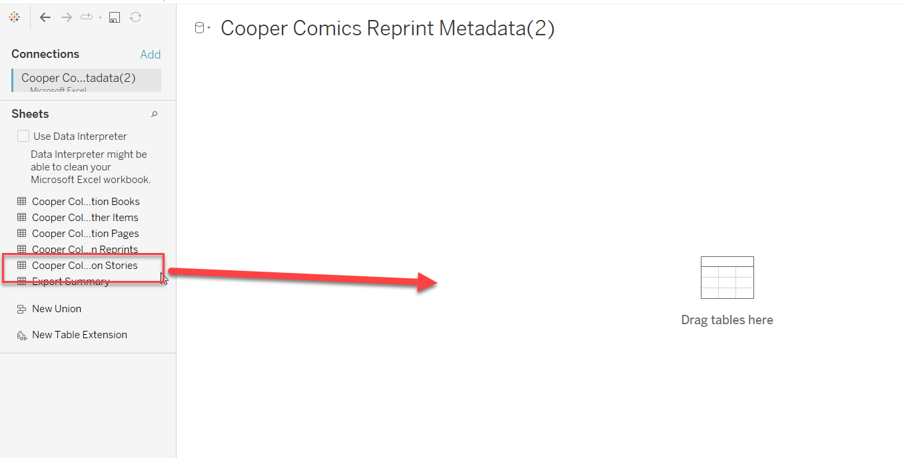  
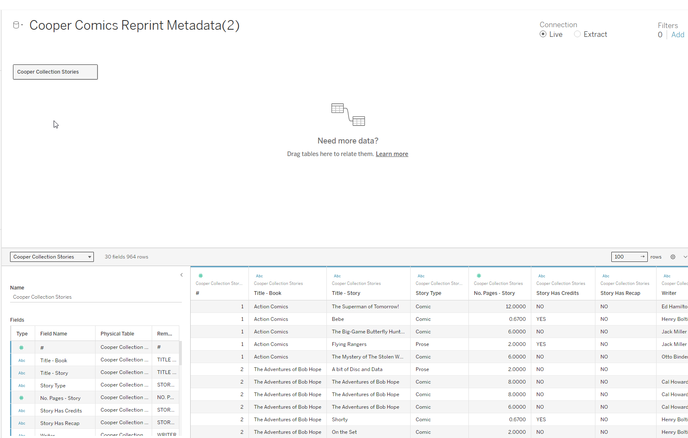
4. Go to Sheet 1 at bottom  

5. In the Sheet
	- left sidebar have the fields, right part of the screen for creating the chart
	- Next to search bar of fields, can "sort by data source order." This means the data will be in the same order as the columns in the original sheet.  

	- Fields divided by data types (dimensions versus measures = qualitative versus quantitative)

## Creating views
Views are created by dragging and dropping fields into different area, similar to the pivot tables. We can create tables (like pivot tables) and graphs

### Table
2. I want to create a table that shows me how many stories of a particular genre are in each book
3. Drag "Title - Book" to the "Rows" above, and "Genre - Story" to "Columns. This creates a table with no values. Drag and drop "Cooper Collection Stories (Count)" to the center of the table.  

6. Now we've got a table of how many stories of a particular genre are in each comic book. We could do the same thing with a pivot table in Excel.

### Table/graph
But this table is kind of hard to read. We could visualize this data better while also maintaining the tabular format.
2. In the sidebar between the fields and the sheet, we can see marks
	- Currently, the "Cooper Collection Stories (Count)" is using "text"
	- We can drag field to size and make the mark based on size  
 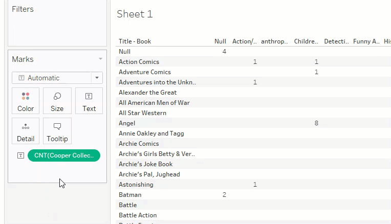
	- Automatically chooses square, but we can change shape (e.g., circle) and adjust size  
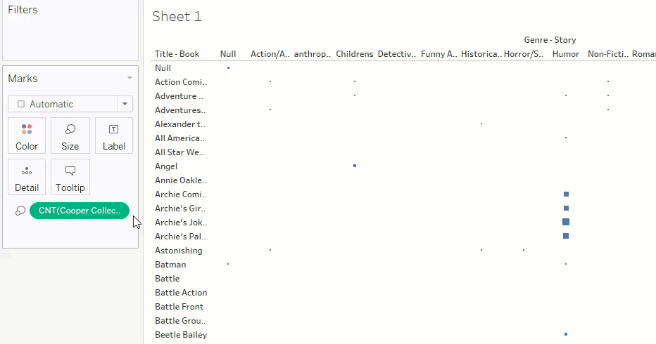
3. Can add more color as well
	- Say want to differentiate color based on genre
	- We drag "Genre-Story" from the fields to "Color" under marks  
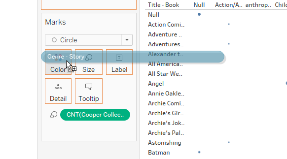  
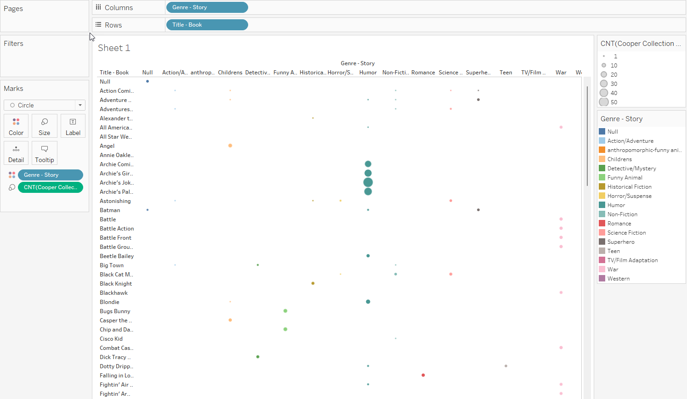

### Graphs
Can also use the "show me" in the corner to see what else we can do   
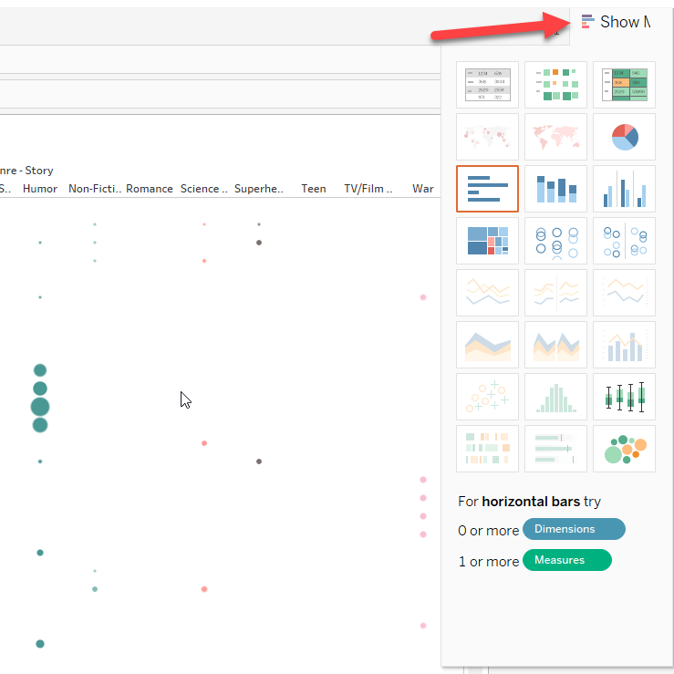
1. For example, top right lets us choose a heat-map style table. Like size, easier to pick out higher than normal values  
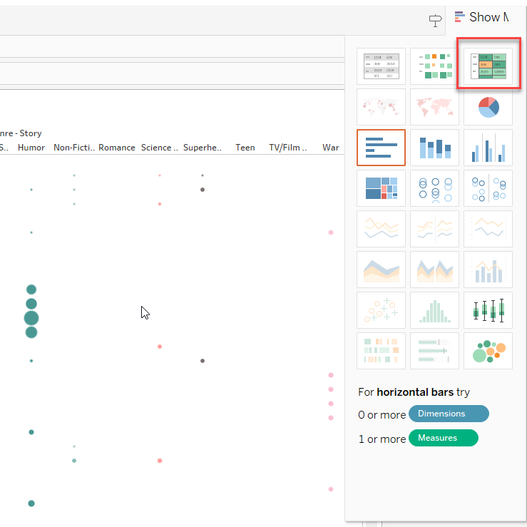  

2. Bar chart gives us the genres, then divided by the book
		- Can see all of the books in the genre and how many stories each book did in that genre  

		- Can switch order in the rows; now see all genres in a single book  
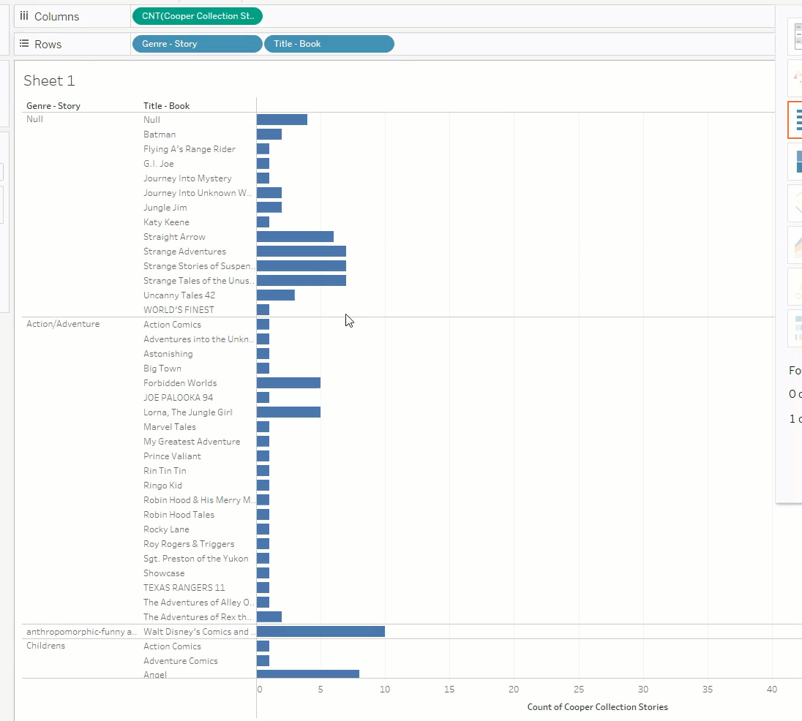
			- Most books doing a single genre
			- plain blue makes boring to read, lets add in color again by dragging "Genre-Story" to "Color"  
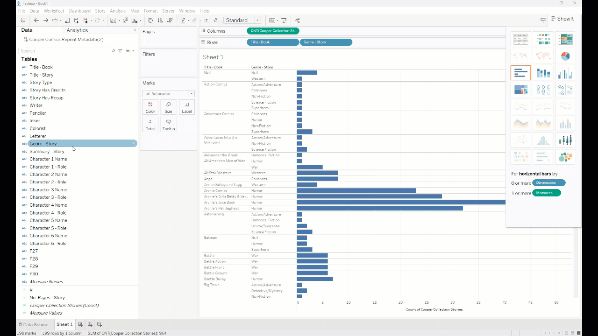
	3. Stacked bar chart, gets more compact view  
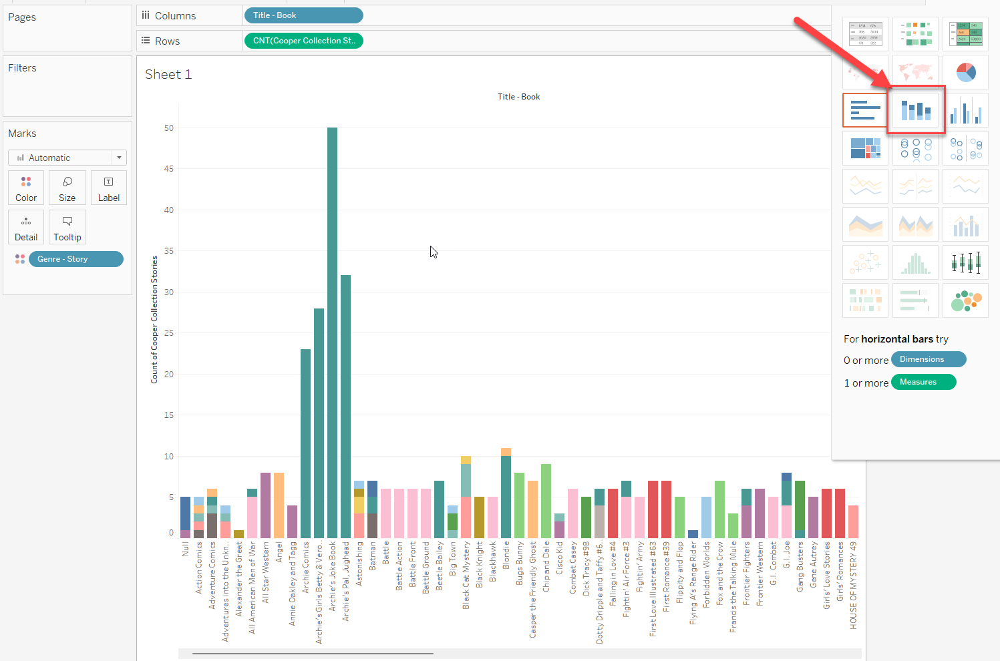
		- Can add numbers in if we want by dragging "Cooper Collection Stories (Count)" to "Label"  

## Joining sheets
What if we want to find out the relationship between story genres and publishers? The stories sheet doesn't have this information, but the books sheet does.  
These sheets have a field in common, "#" which is the book number. We can use this column to join them.
4. If I go back to the "Data Source" tab at the bottom, I can drag the "Books" sheet into the top half  
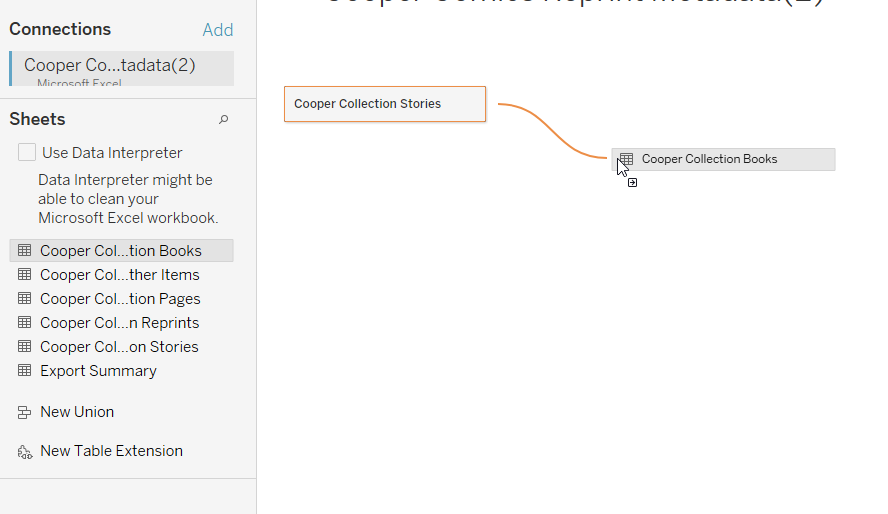
5. Then below, I need to say which field is equivalent in each. Here it's "#"  

6. If we go back to Sheet 1, the left sidebar with the fields now has fields for both tables  
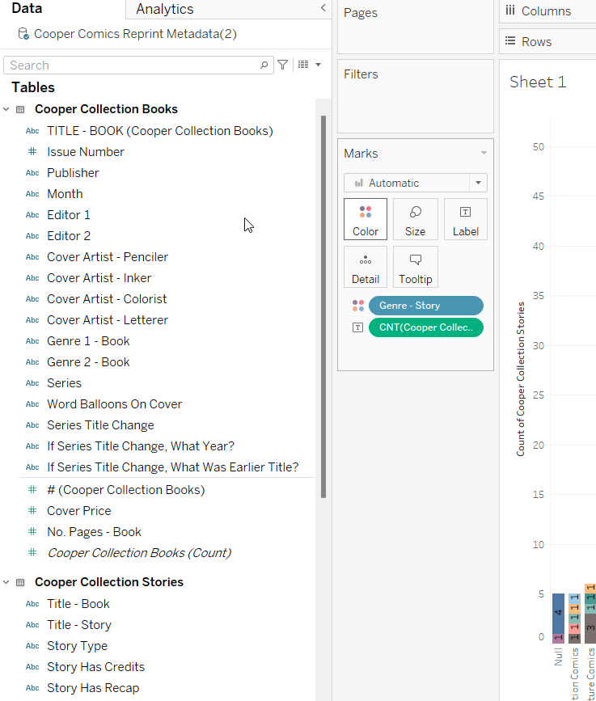

## New and duplicate sheets
### New sheet
1. I don't want to get rid of the view in Sheet 1, but I want a new view about publishers and story genres.
2. Create a new sheet by clicking the first icon with a plus next to Sheet 1. This creates Sheet 2.  

### Duplicate sheet
4. But I basically want the same sheet as Sheet 1, just with publishers instead of titles. So I'm going to duplicate the sheet and change out the fields.  
6. Right click the Sheet 1 tab at the bottom and select "Duplicate."  

8. Now I can take out title-book and add in publisher. And now we can see that:
	- Archie comics was really just doing humor and teen; 
	- Atlas specialized in horror, scifi, war, and westerns; 
	- DC and Quality are the only ones publishing superhero stories; 
	- And Dell seems to appeal to a younger audience with funny animal stories and children's works besides a strong showing in westerns  
  

## Formating graphs

### Add title
1. To change the title of a view, double click on "Sheet 1" above your graph (below the slot for placing fields in Rows). A window will appear and you can edit the text.  

### Edit axis title
1. Axis titles are editable in two ways:
    1. Double click on the axis title in the graph. If a pop-up window appears, you can edit the title there.  
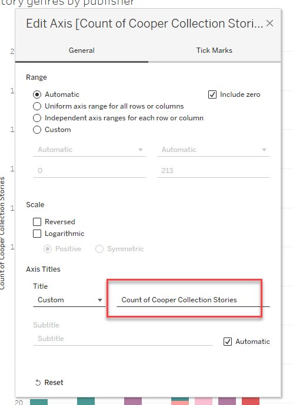
    2. You can right click on the field in the field sidebar and select "Rename" to rename the field.  

### Font, borders, alignment, etc.
1. Other visual aspects like font, borders, and alignment can be edited by going to Format in the top menu and then selecting the relevant item. A menu sidebar will appear where you can make changes.  
  
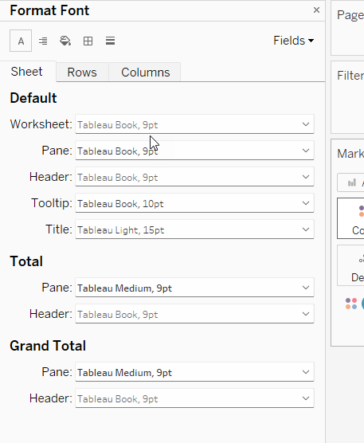
